*** Transaction can only occurred with save / update or delete not with fetch  / select.

** propagation - one transaction within another transaction

Transaction Propagation
=======================

In Transaction context Propagation defines How Transactions are Managed when a method is invoked
within another Transaction where both the methods implemented @Transactional.

If one transaction within another transaction then only you can play with Propagation behavior.

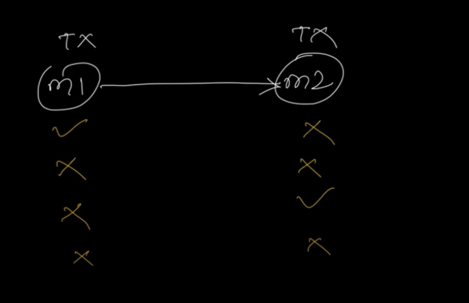

   - let's say u have 2 methods m1 and m2 and both the methods implemented transaction.
   - since here 2 diff methods and both are implemented transactions.
   - let's assume you are invoking m2 from m1. now how u want ur method to be executed.
   - for example let's say m2 transaction is failed then how u want ur m1 transaction to continue whether
     you want to persist the record or you want to revert or rollback the records.
   - similarly let's say m1 transaction is failed then u want to persist the record in m2 transaction
     or u want to rollback everything.
   - *** so there are multiple types of permutation and combination that we can play with PROPAGATION.

# different types of Propagation Enum Properties are-

** By DEFAULT Propagation Type is REQUIRED.
    
    ====================================================================
    ** To Validate or see the Transaction Log add in properties file-

    ## Enable transaction debug logs
    #logging.level.org.springframework.transaction=DEBUG
    #logging.level.org.hibernate.transaction=DEBUG
    #logging.level.org.springframework.orm.jpa.JpaTransactionManager=DEBUG
    ====================================================================

*** Transaction can only occurred with save / update or delete not with fetch  / select.

DB Product added for Testing-

Failure scenario to test- we forcefully throuw an error while updating the product details in inventory if product.price>5000
Happy scenario to test- If Product price is less than 5000.

    insert into Product (name, price, stock_quantity)
    values('Laptop', 25000.0, 10);                  -> Failure Scenario
    
    insert into Product (name, price, stock_quantity)
    values('Smartphone', 5000.0, 12);               -> Happy Scenario
    
    insert into Product (name, price, stock_quantity)
    values('Watch', 1500.0, 50);                    -> Happy Scenario
    
    insert into Product (name, price, stock_quantity)
    values('TV', 75000.0, 4);                       -> Failure Scenario

Propagation.REQUIRED - 
====================

   use an existing transaction or create a new one if not exist.
              
    @Transactional(propagation = Propagation.REQUIRED)

   Since u have defined propagation - REQUIRED, First It will search for is there any active transaction If yes,
   we are good we will re-use that. If not then we will create a New Transaction.

   Let's proved that while you are using Propagation.REQUIRED it will create a single
   Transaction and re-use it.  http://localhost:8080/swagger-ui/index.html#/
                
    Happy Scenario
    ===============

   Earlier Records are in Inventory Table-
   
   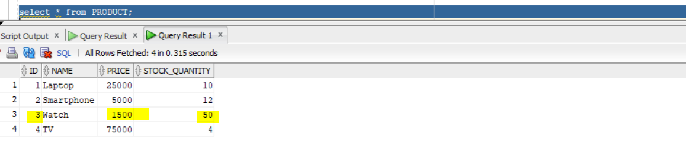
   
   then after placing order from swagger - 
   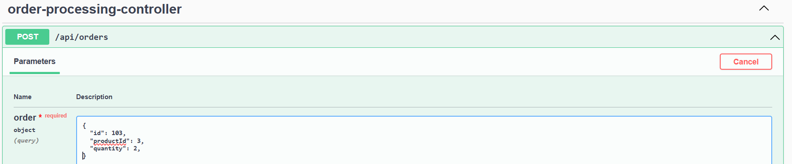
   
   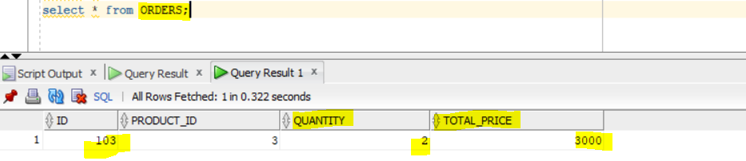
   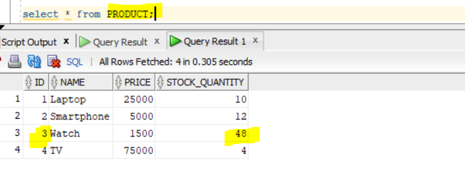
   
    Failure Scenario
    ================

   If anything is getting failed then everything is getting Rolled Back or some partial commit happened in transaction.
   
   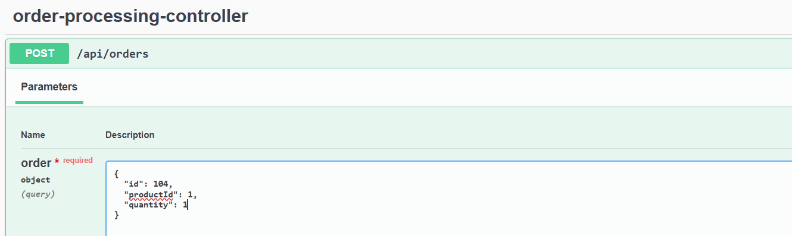
   @Transactional only we should use either create/update/delete operation not with fetch/fetchById

   ** so error occurred and there are no order placed in Order Table and no update in inventory table so everything got rolled back
      so if using Propagation is REQUIRED with @Transactional then either everything got succeeded/saved or everything got rolled back.
      if you see in our main transaction start in class OrderProcessingService with method placeAnOrder 
   
    Now can you Prove it will create a one and only one transaction

   bcz we are creating a transaction while we save order and we are creating another transaction while we update the product table
   but we are creating a main transaction while order will placed.
   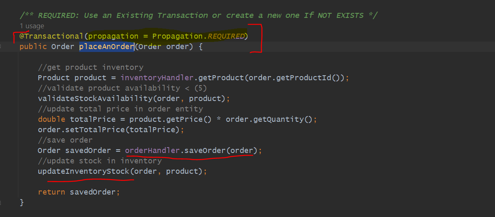
   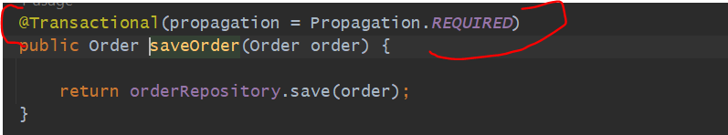
   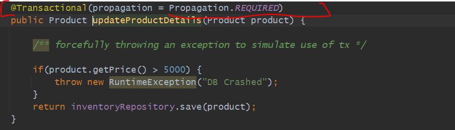
   
   ** so will It create 3 different transactions or will it create a main transaction or will it re-use transaction if anything is active.
    to proof that put debug log in yml file let's go with . so, REQUIRED is not creating any duplicate transaction  rather than it will be using if any active transaction.
   
    Happy Scenarios.

   {
    "id": 105,
    "productId": 3,
    "quantity": 1
   }
   
   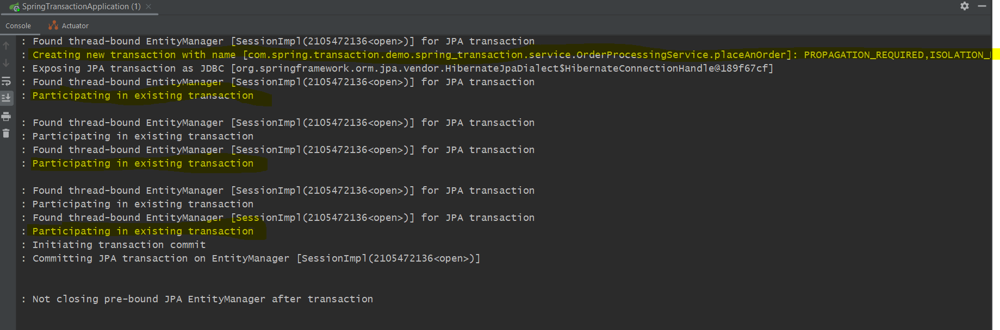
 
    which mean If you are defining REQUIRED it will re-use the transaction if anything exist , If not then it will create 
    a new transaction. so, REQUIRED should be used when you want everything should be failed or everything succeeded.
    If you have a usecase if there is any failure you don't want to keep the any unused data rather you want to revert
    everything then go for PROPAGATION = REQUIRED.

Propagation.REQUIRES_NEW 
=========================

when can we go for REQUIRE_NEW.

Always create a new Transaction, suspending if any existing transaction. 
  
    I always need to create a new transaction irrespective of something running or not, If something running i found
    i will suspend that till my execution completed.

    now both operation/transaction save order and update inventory running inside single transaction. but we want irrespective of there 
    2 operations whether it succeeded or failed we want to keep an Audit log. so that we can track the failed orders and we can pro-activeky
    remind them which will improve my application for customer engagement. so that we can re-process those failed records.

Use-Case
--------

Irrespective of save order and update inventory if anything is going failed, then i want to keep a audit log for those failed records
so that we can re-process them. how you are going to handle those situations.

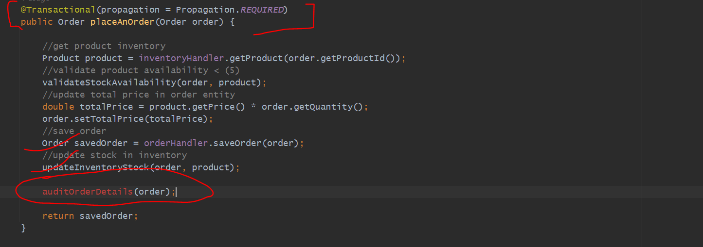

    suppose you are adding auditOrderDetails in main transaction. now since we are writing this method inside transaction where type
    is REQUIRED which means If save order failed or update Inventory failed then this will also get reverted right? 
    But I don't want to do that Irrespective of Tx success or failure i want to keep a log of that so in that case you must have
    to define auditOrderDetails method as REQUIRES_NEW Propagation. 
    
    So, Always I need a New Transaction even though save order and update inventory running in a main transaction i don't want them
    I don't want to use that transaction rather I want to create a new Transaction 

    *** In Such case whether irrespective of success or failure on existing transaction you must want to execute your things then 
        you can go for REQUIRES_NEW. 

let's create an audit log entity/repository/handler to develop and test the scenario.

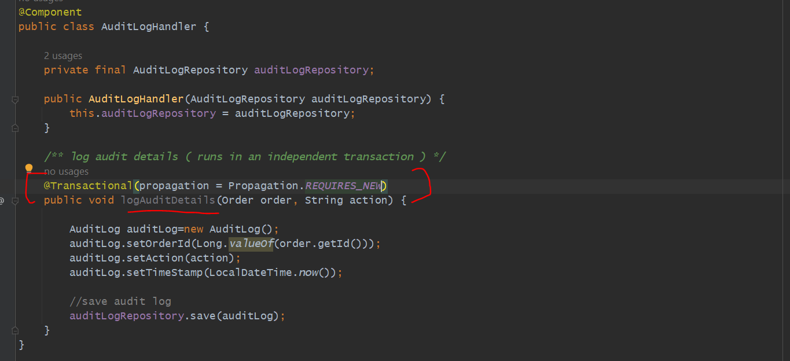
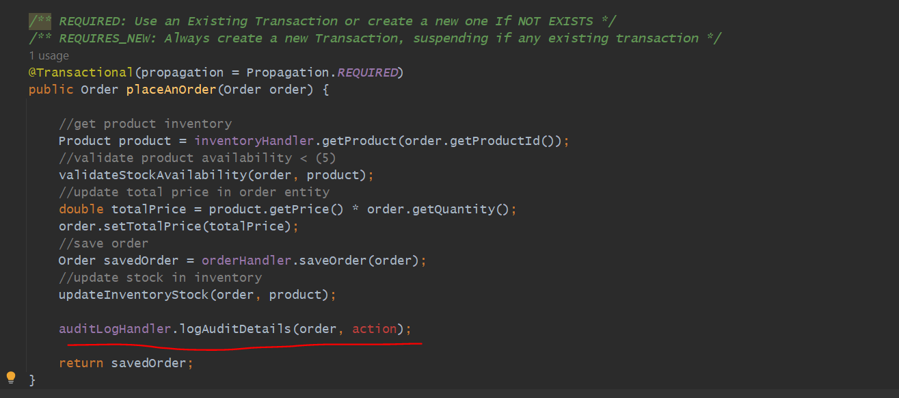

so we need order and action. we don't know whether it is in succeeded or failure for that we can keep them in a try & catch.
so, in catch the action will be failed if in try then action will be succeeded.

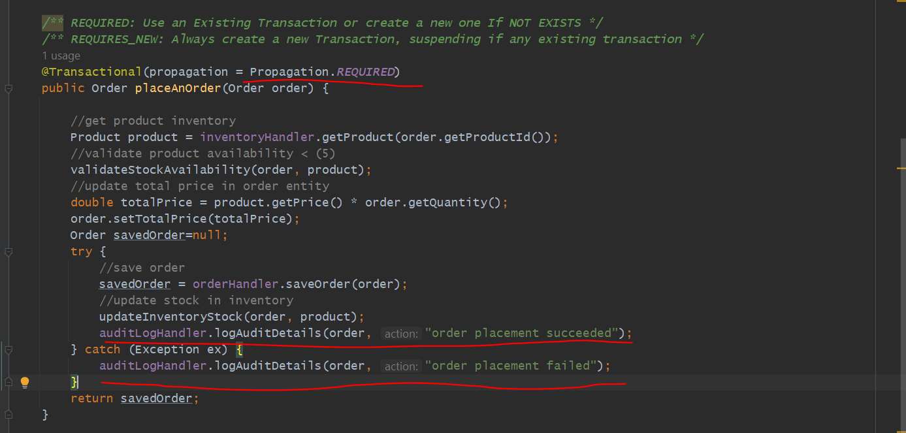

I want to keep audit log for my success and failure so that i can remind user for retry for a failed order.

    Testing Scenarios

    Happy Scenario

   {
    "id": 106,
    "productId": 3,
    "quantity": 2
   }

now to validate let's check the log

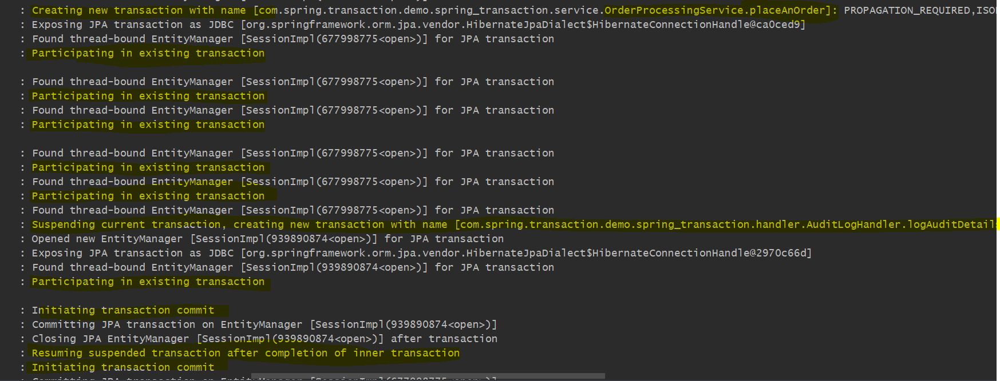

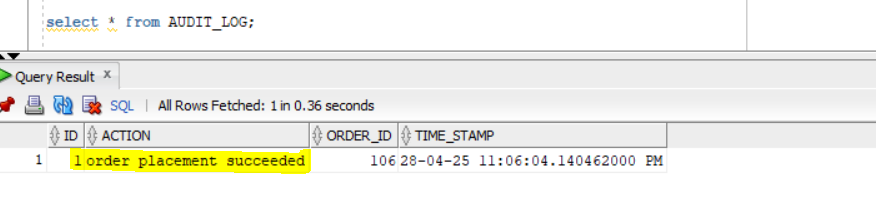

    first it create a new transaction place an order that is our main tx bcz we define propagation required. 
    now it will save the order and it will use existing transaction. then it will update inventory it will
    use existing tx. now if u see suspending existing tx and creating a new tx with audit log. bcz this method is the
    the place where we define REQUIRES_NEW tx. once this audit log code block exexuted it will release the lock
    then ur existing tx will be executed. and we can see it added the log to audit table also.

    Failure Scenario
    ----------------

    what we are expecting since we defined the REQUIRES_NEW, and we understand from log it is creating a new transaction. 
    so, if there is any failure for creating the order or updating the inventory irrespective of that result my transaction
    should execute and it should keep an audit log for me.

   {
    "id": 107,
    "productId": 1,
    "quantity": 1
   }

   so there are no new order created in Orders table and no update found in product table. but we can see we have one
   entry in audit log table for a failed scenarios bcz we have defined requires_new so it must be execute.

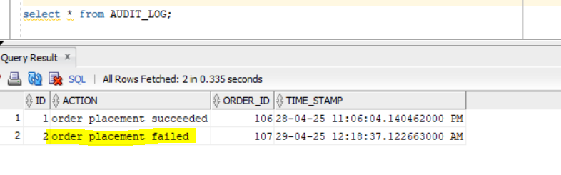

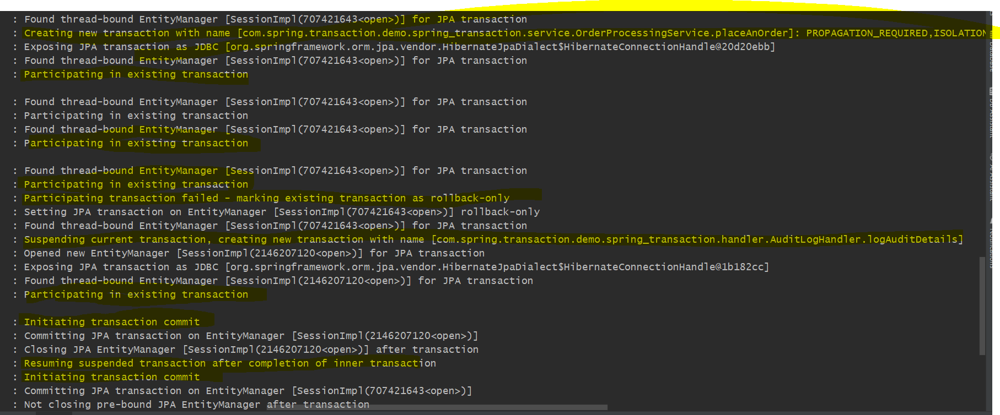
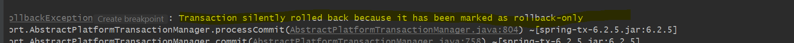

        REQUIRED and REQUIRES_NEW are the 2 Propagation widely used in our Industry.

Propagation.MANDATORY
=========================

It will require an existing transaction, If nothing will be found it will throw an exception.

    It says if the method is called within an existing transaction It will participate in that active transaction. 
    If the method is called out-side of the active transaction then it will simply throw an exception called 
    IllegalTransactionStateException. 

use-case
--------

so here you have persist the transaction and also u are updating the inventory. now what i want to implement here.
I want to validate the payments. If the payment failed we still want to track the payemnt failure in a separate log
in a but i don't want to roll-back the entire order creation and update inventory mechanism. 

    I want to validate the payment and i want to use the existing Transaction i don't want to create 
    any new transaction. 
    MANDATORY means i need my method to execute within any existing 
    transaction. If I won't found any transaction i will cry!! 

so forcefully i will failed a payment and keep an audit log.
*** this validatePayment we want to run in an existing transaction. 

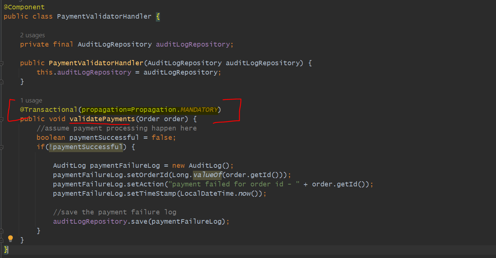

    this particular method payment validate transaction even though this particular method failed here and if i called
    them from order processing service it will not harm or impart to this particular transaction place and order.
    ** If any exception or error in payment method then still ur order data will be save and update inventory it will
    not impact ur transaction. but this guy just requesting to use ur transaction.

    Happy Scenario
    ----------------

   payload
    {
    "id": 107,
    "productId": 3,
    "quantity": 2
    }
   let's verify log since we are using MANDATORY propagation so it should not create any new transaction.

   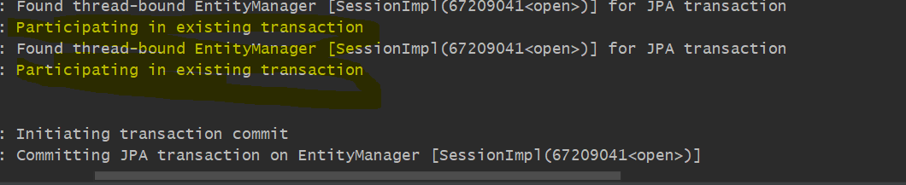
   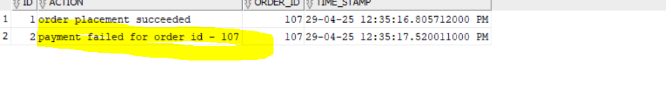
   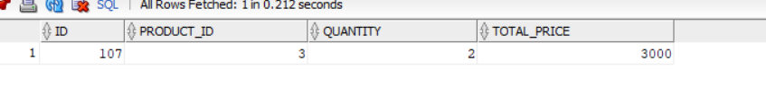
   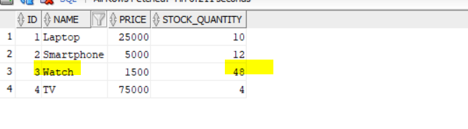

   for this happy scenario we can see data recorded in audit log , it got save in order table.
   updated inventory for particular order.
 
   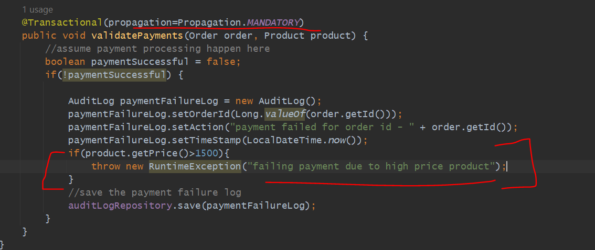
            
    here the catch is while our payment method annotated with Propagation.MANDATORY and our payment will
    failed then also it should not impact or main transaction or existing tx and our order should be save and
    inventory should be updated.

  
    Failure Scenario
    ----------------

    If no existing Transaction found then it will throw an exception

  ** let's comment main transaction REQUIRED.

   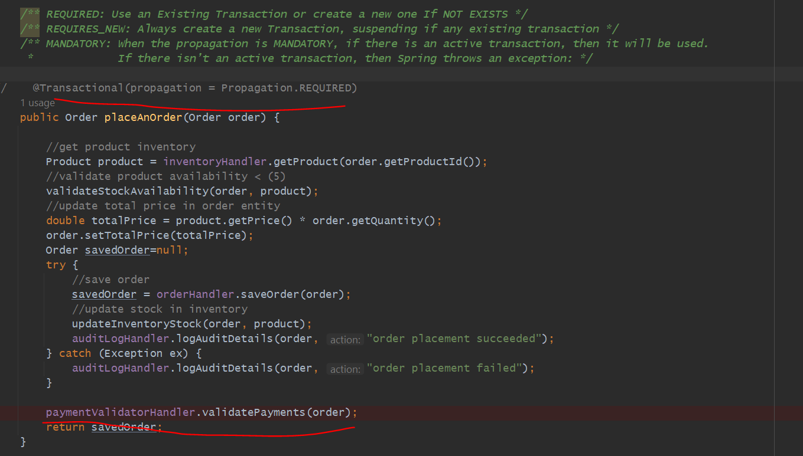

    {
    "id": 111,
    "productId": 3,
    "quantity": 1
    }

   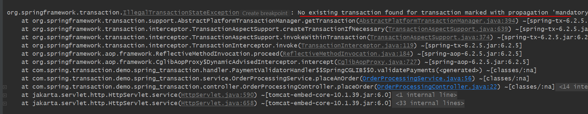
   
   ** after testing complete let's comment this paymentValidatorHandler.validatePayments(order);.

Propagation.NEVER
==================

    If we define propagation NEVER it will ensure that the method will be execute without any transaction. It never
    need any transaction If it found any transaction then it will throw an exception.

    NEVER: Ensure that the method will run without transaction If found any tx will throw an exception.

Use-Case
--------

    while placing an order we are updating our order db and we are updating the inventory product table. 
    Now I also want to send order confirmation to the user.
    But this I want to execute without any Transaction. 

    ** let's say i am using this within tx with same flow . now if save order is failed or update inventory is 
    failed then we do retry in real time. if i do 3 time retry then 3 times mail will sent which is not good. 
    I want this to be out of transaction.

 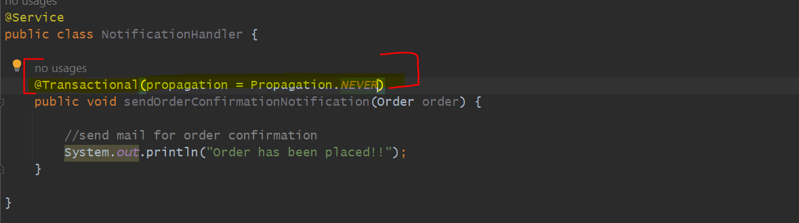

    Negative Scenario
    -----------------

 let's try to run within our existing transaction.

  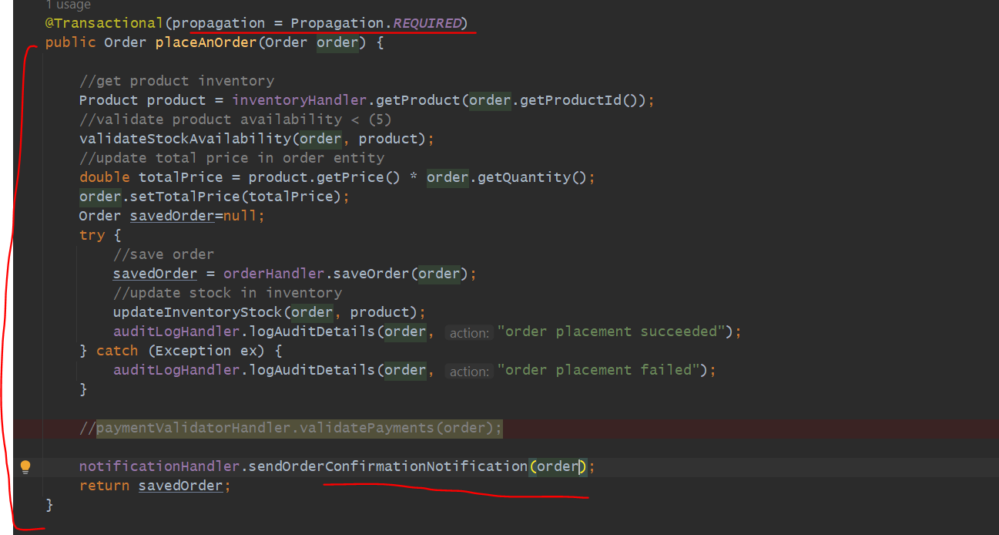

{
 "id": 103,
 "productId": 3,
 "quantity": 1
}

    Exception : org.springframework.transaction.IllegalTransactionStateException: Existing transaction found 
    for transaction marked with propagation 'never'

    Happy Scenario
    ---------------

    let's keep this order confirmation with propagation type NEVER outside a transaction.
 
   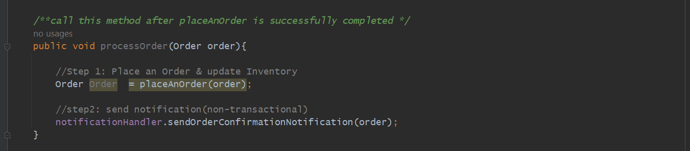

Propagation.NOT_SUPPORTED
=========================

    NOT_SUPPORTED: Execute method without Transaction, suspending If found any transaction.
    I will not support Transaction so don't come in my way.

Use-Case
--------

    This type of Propagation is useful when you want to perform an operation that doesn't require a transaction like 
    you just want to perform some Read only operation. or you just want to logging or sending order confirmation.

     when you place an order u update the order db and update the inventory. so next time on word i can give u a 
     feature product recommendation. like when doing shopping in flipkart/amazon they will also fetch and give recommendation 
     for similar kind of products.

    Let's provide the product Recommendation which is kind of READ operation. just fetch product from product inventory
    by just providing the filter and all so, In that case i don't need any transaction. If any transaction come i will simply
    suspend them. In such kind of scenario we should go for Propagation.NOT_SUPPORTED.

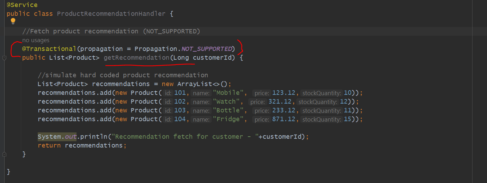

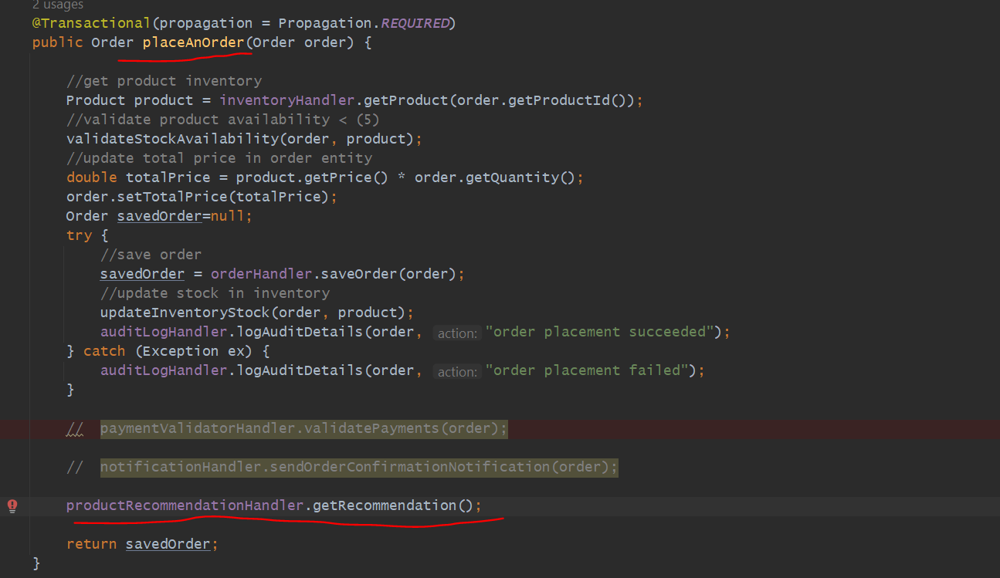

        Happy Scenario & Failure Scenario
        ----------------------------------

        In both the scenarios it will work bcz as it say if we are having any transaction then also i am going to suspend
        and execute and if i donot have any existing transaction also then i am good in both the cases i will be execute.

  let's verify the log.

   Happy Scenario

    {
    "id": 104,
    "productId": 3,
    "quantity": 1
    }

 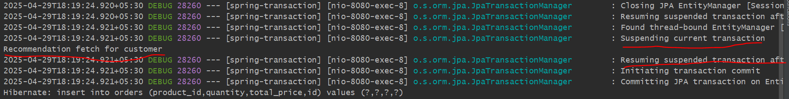

  before recommendation fetch for customer it found there is an active transaction for order place for a customer so, it suspends 
  that trx and once it's done the execution then resumed the existing transaction.

   Failure Scenario

    {
    "id": 105,
    "productId": 1,
    "quantity": 1
    }
     
  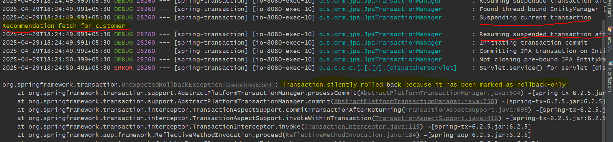

  there is a failure in trx and order table and product inventory table rolled back but NOT_SUPPORTED method
  got executed bcz it doesn't matter either any trxn or not it will execute always.

Propagation.SUPPORTS
====================

    SUPPORTS: Supports If there is any Active transaction, If not execute without transaction as well

  use-Case
  --------
    
    while place an order you might need the customer details. customer delivery details, customer address details
    to dispatch the products. that is simple that is a Get call if you want you can keep that in a transaction inside also
    if not then also there is no issue. or u can consider last use case get recommendation as well.

   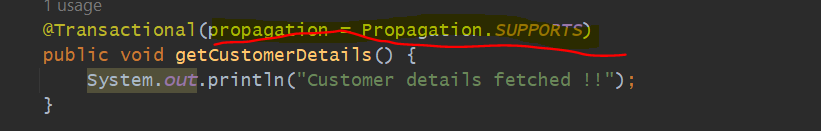

   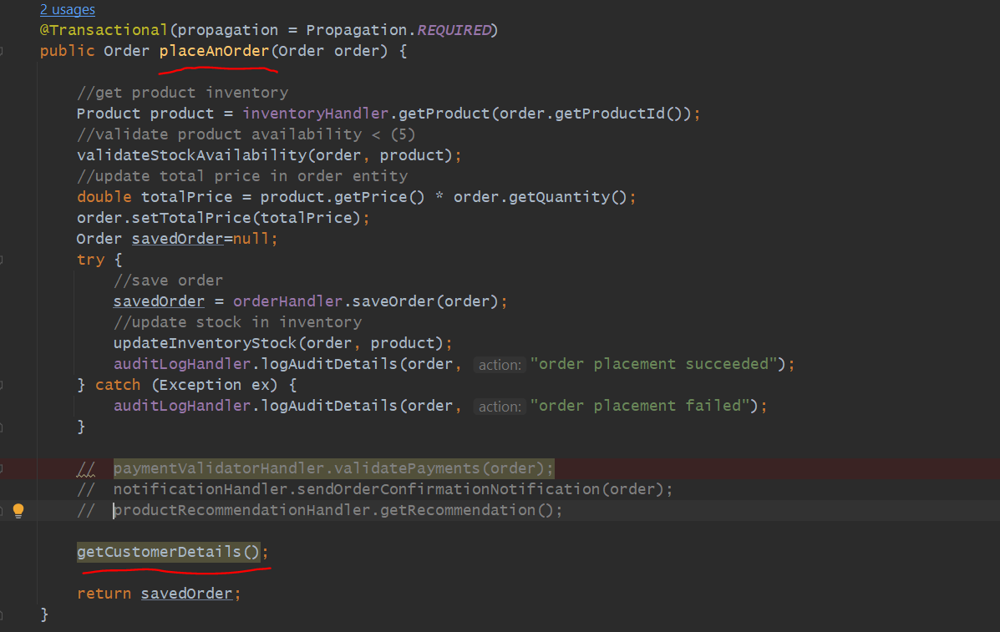

    Happy Scenario   -  within  Transaction

   {
    "id": 106,
    "productId": 3,
    "quantity": 1
   }  

  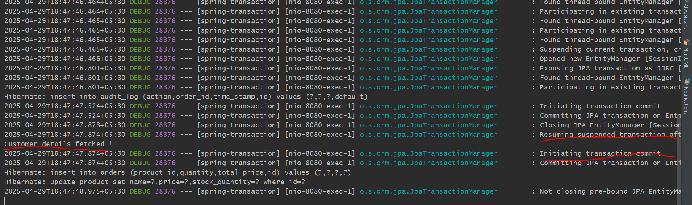

    It run with trxn also, it will suspending trxn then execute after that resumimg existing trxn.

    Failure Scenario   -  without Transaction

   {
    "id": 107,
    "productId": 3,
    "quantity": 1
   }

  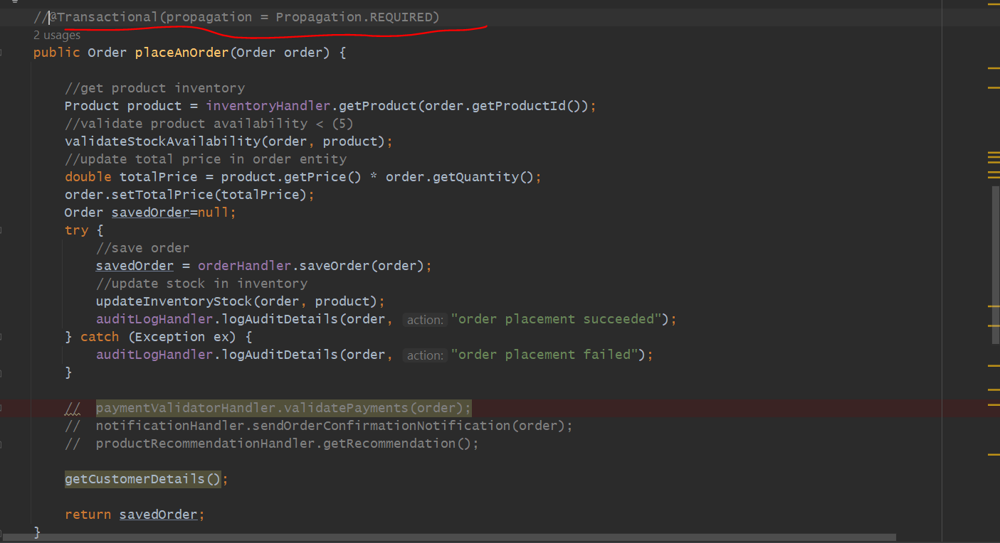
  
  we have commented the main trxn and now it will work like a normal method.
  
  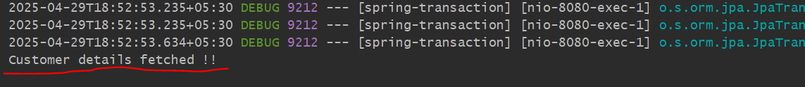

Propagation.NESTED
==================

   JPA directly not supports the NESTED.
  
    Execute within a nested transaction, allowing nested transaction to rolled back independently,
                If there is any exception or error without impacting outer transaction
    

    I want to execute some logic in NESTED trxn propagation but if there is any failure or exception occurred 
    then it should not break or rollback outer trxn only it will impact and rollback the nested trxn.

    /** REQUIRED: Use an Existing Transaction or create a new one If NOT EXISTS */
    /** REQUIRES_NEW: Always create a new Transaction, suspending if any existing transaction */
    /** MANDATORY: When the propagation is MANDATORY, if there is an active transaction, then it will be used.
     *             If there isn’t an active transaction, then Spring throws an exception: */
    /** NEVER: Ensure that the method will run without transaction If found any tx will throw an exception */
    /** NOT_SUPPORTED: Execute method without Transaction, suspending If found any transaction. */
    /** SUPPORTS: Supports If there is any Active transaction, If not execute without transaction as well */
    /** NESTED: Execute within a nested transaction, allowing nested transaction to rolled back independently
                If there is any exception or error without impacting outer transaction */

